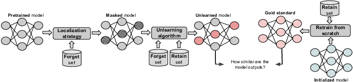

# Deletion by Example Localization (DEL)
"Improved Localized Machine Unlearning Through the Lens of Memorization", Under review at ICML

Deletion by Example Localization (DEL) has two components: a localization strategy that identifies critical parameters 
for a given set of examples, and a simple unlearning algorithm that finetunes only the critical parameters on the data 
we want to retain. Our experiments on different datasets, forget sets and metrics reveal that DEL outperforms prior work
in producing better trade-offs between unlearning performance and accuracy.



# Running Experiments 
The current version supports three dataset/model settings: CIFAR-10/ResNet-18, SVHN/ViT and ImageNet-100/ResNet-50.
The supported forget set modes are IID and Non-IID. In addition to DEL, this codebase also supports several other
unlearning algorithms (e.g., SalUn, Finetuning, L1-sparse, Negrad+, SSD, IU, and others)

## CIFAR-10/ResNet-18 (Non-IID) 
To run multiple experiments applying DEL on CIFAR-10/ResNet-18 with a Non-IID forget set containing 10% of the samples, but only from class 2
and class 5, use the following scripts:

 - (1) Pretrain a model on a dataset: 
    ```bash
    ./scripts/run_pretrain.sh
    ```

 - (2) Construct the forget set and train the Oracle model: 
    ```bash
    ./scripts/run_oracle_train.sh
    ```

 - (3) Generate the mask for localized unlearning algorithms: 
    ```bash
    ./scripts/run_generat_mask.sh
    ```

 - (4) Run the unlearning algorithm: 
    ```bash
    ./scripts/run_unlearn.sh 
    ```

## Other settings
To run any of the four aforementioned steps by applying any of the supported unlearning algorithms on any of the other 
settings (i.e., SVHN/ViT and ImageNet-100/ResNet-50 with arbitrary IID or Non-IID forget sets), use the following commands:
 - (1) Pretrain a model on a dataset: 
    ```
   python pretrain.py  --dataset dataset_name \
                        --model model_name \
                        --batch_size batch_size \
                        --learning_rate learning_rate \
                        --epochs number_of_epochs \
                        --base_dir base_directory
    ```

 - (2) Construct the forget set and train the Oracle model: 
   ```
   python oracle_train.py  --dataset dataset_name \
                           --model model_name \
                           --batch_size batch_size \
                           --learning_rate learning_rate \
                           --epochs number_of_epochs \
                           --base_dir base_directory \
                           --forget_ratio forget_set_ratio \
                           --forget_mode forget_mode_iid_noniid\
                           --forget_classes classes_to_forget_from\
      ```

 - (3) Generate the mask for localized unlearning algorithms: 
   ```
   python generate_mask.py --dataset dataset_name \
                           --model model_name \
                           --forget_ratio forget_set_ratio \
                           --forget_mode forget_mode_iid_noniid \
                           --forget_classes classes_to_forget_from \
                           --forget_data_dir path_to_forget_indices \
                           --pretrained_dir path_to_pretrained_model \
                           --critic_criteria parameter_criticality_criteria\
                           --granularity parameter_selection_granularity \
                           --threshold  parameter_selection_threshold\
     ```

 - (4) Run the unlearning algorithm: 
   ```
   python unlearn.py  --dataset dataset_name \
                      --model model_name \
                      --forget_ratio forget_set_ratio \
                      --forget_mode forget_mode_iid_noniid \
                      --forget_classes classes_to_forget_from \
                      --forget_data_dir path_to_forget_indices \
                      --pretrained_dir path_to_pretrained_model \
                      --learning_rate learning_rate \
                      --epochs number_of_epochs \
                      --mask_dir path_to_the_localization_mask \
                      --unlearning_alg unlearning_algorithm \
      ```
# Citation
If you find the provided code useful for your research, please consider citing our paper:
```bibtex
@article{
torkzadehmahani2025improved,
title={Improved Localized Machine Unlearning Through the Lens of Memorization},
author={Reihaneh Torkzadehmahani and Reza Nasirigerdeh and Georgios Kaissis and Daniel Rueckert and Gintare Karolina Dziugaite and Eleni Triantafillou},
journal={Transactions on Machine Learning Research},
issn={2835-8856},
year={2025},
url={https://openreview.net/forum?id=zXAVdHYPIB},
note={}
}
